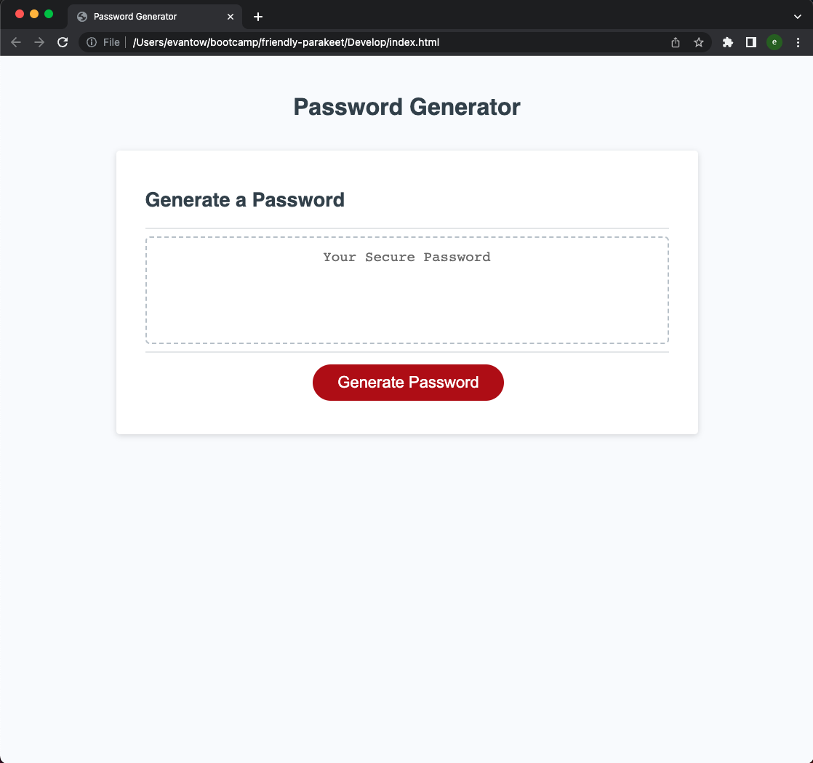
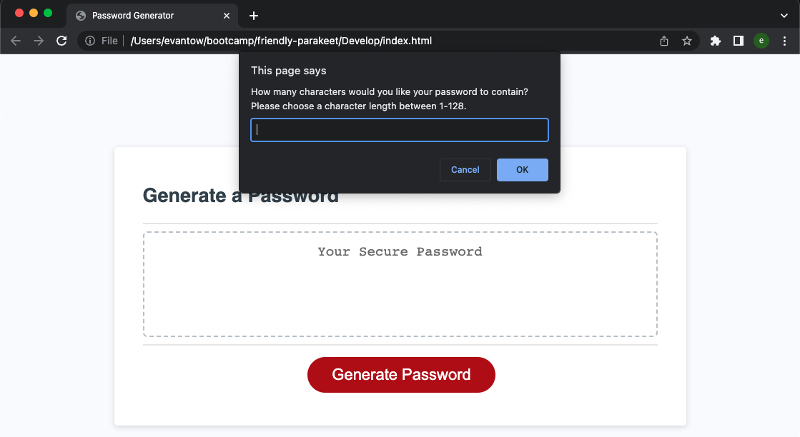
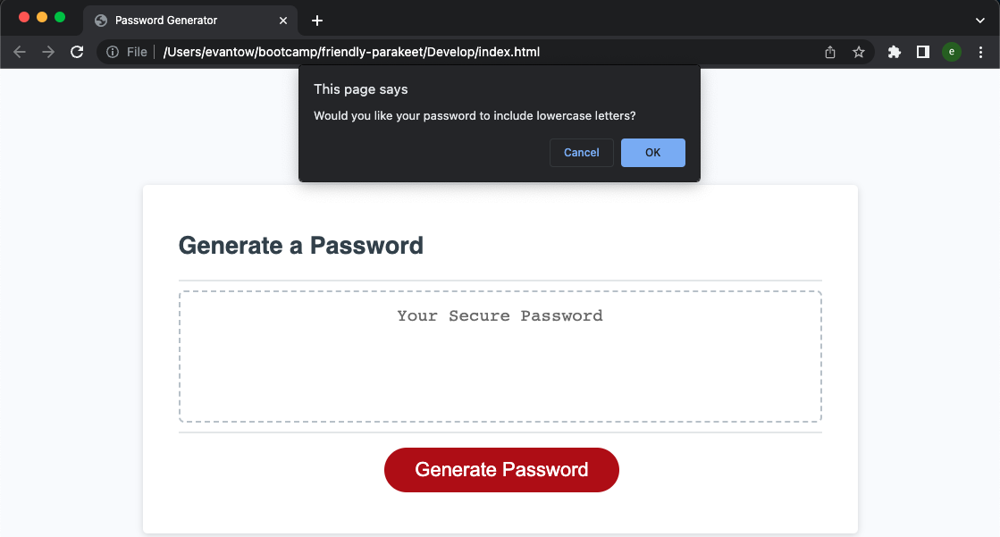

# Random Password Generator

## Description
This is a random password generator created by Evan Towlerton. It's purpose is to generate a new password for the user based on a number of user selected criteria. Theses criteria include: Password Length / Include Lowercase Letters / Include Uppercase Letters / Include Numbers / Include Symbols. This is extremely useful for someone who is weary about using the same password for everything and would prefer to randomly generate a new password for various different websites / applications.

## Installation
N/A

## Usage

Link to the deployed application: 

To use this application to generate a random password you must first establish the length of the password and what character types to include.
To begin start by pressing the red generate button on the homescreen.

You will be then prompted to choose a password length between 8 - 128, which you would then input your desired password length into.

Example of Character Length Prompt shown above.

You will then be prompted to choose what type of characters you would like your password to include. You must select atleast one type of character or the application will not execute. The type of characters you can include are upper/lower case letters / numbers / and symbols.

Example of a Character Type Prompt shown above.

The application will then generate a random password based on the user selected criteria. The generated password will then appear in large text box above the generate button.

Example of a completed generated password.

## Credits
Collaborators: Xandromus (Xander Rapstine) Github Link: https://github.com/Xandromus
He created the starter code for this project.

## License

MIT License

Copyright (c) [2022] [Evan Towlerton]

Permission is hereby granted, free of charge, to any person obtaining a copy
of this software and associated documentation files (the "Software"), to deal
in the Software without restriction, including without limitation the rights
to use, copy, modify, merge, publish, distribute, sublicense, and/or sell
copies of the Software, and to permit persons to whom the Software is
furnished to do so, subject to the following conditions:

The above copyright notice and this permission notice shall be included in all
copies or substantial portions of the Software.

THE SOFTWARE IS PROVIDED "AS IS", WITHOUT WARRANTY OF ANY KIND, EXPRESS OR
IMPLIED, INCLUDING BUT NOT LIMITED TO THE WARRANTIES OF MERCHANTABILITY,
FITNESS FOR A PARTICULAR PURPOSE AND NONINFRINGEMENT. IN NO EVENT SHALL THE
AUTHORS OR COPYRIGHT HOLDERS BE LIABLE FOR ANY CLAIM, DAMAGES OR OTHER
LIABILITY, WHETHER IN AN ACTION OF CONTRACT, TORT OR OTHERWISE, ARISING FROM,
OUT OF OR IN CONNECTION WITH THE SOFTWARE OR THE USE OR OTHER DEALINGS IN THE
SOFTWARE.

## Badges

N/A

## Features

N/A

## How to Contribute

A potential improvement to the website could be to create a button that allows the user to copy the generated password to the clipboard by clicking on it.

Another potential improvement that might be of use would be to allow users to categorize and save their generated passwords, almost like a password bank and have labels for what passwords work for individual websites / applications.

## Tests

A user could potentially test trying to enter different input values into the prompts and see if I have missed a validation check. Their is supposed to be a validation test that checks to make sure the user has inputted an applicable password length and has selected atleast one character type, however this feature has not been thoroughly tested to make sure user-error is not possible.
